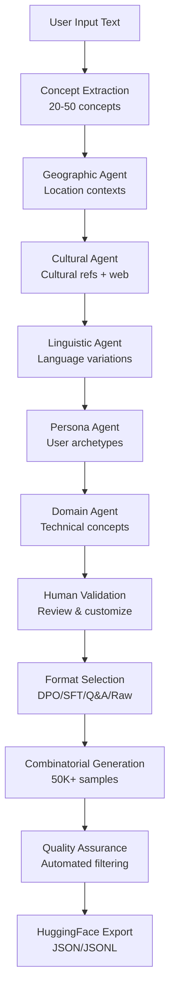

# Synthetic Data Platform

**AI-powered combinatorial synthetic data generation with specialized agents**

A complete platform for generating high-quality synthetic datasets using multiple specialized AI agents and advanced GPU parallelization.

## Key Features

### **8-Stage Pipeline**

1. **Input Processing** - Procesamiento y validación de entrada
2. **Concept Extraction** - Extracción de 20-50 conceptos clave
3. **Multi-Dimensional Characterization** - 5 agentes especializados
4. **Human Validation** - Validación y personalización
5. **Format Selection** - Múltiples formatos (SFT, DPO, Q&A, RAW)
6. **Combinatorial Generation** - Generación masiva con paralelización GPU
7. **Quality Assurance** - Filtrado automático de calidad
8. **Dataset Export** - Exportación automática en JSON, CSV, Parquet

### **5 Specialized Agents (Pure LLM)**

- **Geographic Agent** - Contextos geográficos y regionales
- **Cultural Agent** - Matices culturales y sociales
- **Linguistic Agent** - Variaciones lingüísticas y dialectos
- **Persona Agent** - Perfiles demográficos detallados
- **Domain Agent** - Expertise específico del dominio

### **GPU Parallelization (H100 Ready)**

- **Configurable**: 1-8 simultaneous GPUs (editable in `config/gpu_config.py`)
- **Batch Processing**: Automatically distributes load
- **Real-time Progress**: "Generating samples 117/125 (Batch 3/8)"
- **Performance**: From 40 min → 10-12 min with 4 GPUs

### **Automatic Multi-Format Export**

- **JSON** - Always generated, ideal for APIs
- **CSV** - For visualization and analysis
- **Parquet** - For large datasets (>10 samples)
- **Direct download** from frontend
- **Complete management API**

### **Completely General**

- Gaming toxicity (League of Legends)
- Healthcare AI (diagnosis platforms)
- Any domain - The platform is content-agnostic

## Architecture

### Backend (Python + FastAPI + WebSocket)

```
backend/
   main.py                    # FastAPI application entry point
   agents/                    # 5 Specialized AI Agents
      concept_extractor.py   # Step 2: Extract core concepts
      geographic_agent.py    # Geographic contexts & regulations
      cultural_agent.py      # Cultural refs + web scraping
      linguistic_agent.py    # Language variations & styles
      persona_agent.py       # User archetypes & demographics
      domain_agent.py        # Technical concepts & expertise
   core/
      pipeline.py            # 8-step pipeline orchestrator
      combinator.py          # Combinatorial generation engine
   api/                       # REST + WebSocket API Endpoints
      websocket.py           # WebSocket connection manager
      pipeline_websocket.py  # Real-time pipeline updates
      extraction.py          # Steps 1-2: Input + concept extraction
      characterization.py    # Step 3: Multi-agent characterization
      validation.py          # Step 4: Human validation interface
      generation.py          # Steps 6-8: Generation + export
   utils/
       ollama_client.py       # Configurable Ollama client
       prompt_loader.py       # YAML prompt template loader
```

### Configuration & Prompts

```
config/
   models.yaml               # Switch between llama3.2-3b/8b models

prompts/                      # Centralized prompt templates
   extraction/
   characterization/         # Templates for each agent
   generation/              # Templates for each output format
```

### Frontend (React + Vite + WebSocket)

```
frontend/src/
   App.jsx                   # Main application (single column layout)
   components/
      InputSection.jsx       # Document upload & text input
      GenerationModal.jsx    # Format selection & generation config
      StageIndicator.jsx     # Real-time progress indicator
   hooks/
      usePipelineWebSocket.js # WebSocket pipeline state management
      useWebSocket.js        # Core WebSocket connection
   styles/
      animations.css         # Breathing/pulsing animations
```

## Current Implementation Status

### **Phase 1: Backend Core (COMPLETED)**

**Specialized Agents:**

- Concept Extractor - Extracts 20-50 concepts from input
- Geographic Agent - Location contexts, regulations, regional variations
- Cultural Agent - Cultural references, expressions + web scraping
- Linguistic Agent - Language variations, communication styles
- Persona Agent - User archetypes, demographics, role perspectives
- Domain Agent - Technical concepts, industry terminology

**Infrastructure:**

- Ollama Client - Configurable models (llama3.2-3b/8b switching)
- Prompt Loader - YAML-based prompt templates
- Base Agent - Common functionality for all agents
- Combinator - 50K+ sample combinatorial generation

**API Endpoints:**

- Extraction API - `/api/extraction` (Steps 1-2)
- Characterization API - `/api/characterization` (Step 3)
- Validation API - `/api/validation` (Step 4)
- Generation API - `/api/generation` (Steps 6-8)
- WebSocket API - Real-time pipeline updates

**Pipeline:**

- Pipeline Orchestrator - Complete 8-step workflow
- Sequential Agent Testing - System validation script

### **Phase 2: Frontend Implementation (COMPLETED)**

**Core Components:**

- InputSection - Document upload with file type detection
- ConceptContainer - Core concepts display with manual editing
- GenerationModal - Format selection + samples per category configuration
- StageIndicator - Minimalist progress indicator (bottom-right)

**Real-time Features:**

- WebSocket Integration - Real-time pipeline progress updates
- Progressive Disclosure - Input → Core Concepts → Dimensions → Generate
- Auto-advance Flow - Concepts automatically proceed to characterization
- Manual Concept Addition - Add/remove concepts via comma-separated input

**UI/UX:**

- Single Column Layout - Centered layout following HTML dummy design
- Breathing Animations - Visual feedback during processing
- 5 Dimension Grid - Geographic, Linguistic, Cultural, Persona, Domain
- Clean Design - Professional green/grey theme without emojis

**State Management:**

- usePipelineWebSocket - Complete pipeline state management
- useWebSocket - Core WebSocket connection handling
- Real-time Updates - Progress tracking and error handling

### **Phase 3: Integration & Testing (IN PROGRESS)**

- Frontend-Backend WebSocket Integration
- Real-time Pipeline Progress Updates
- Concept Extraction → Characterization Flow
- Generation Modal Integration (needs refinement)
- End-to-End Pipeline Testing
- Error Handling & Edge Cases
- Performance Optimization

### **Phase 4: Production Features (PENDING)**

- BERT-based Quality Assurance Models
- Advanced Web Scraping for Cultural Agent
- Template System Extensions
- Batch Processing Optimizations
- Export Format Extensions

## Setup & Installation

### Prerequisites

- Python 3.8+
- Node.js 16+
- Ollama installed and running
- llama3.2:3b or llama3.2:8b model pulled

### Backend Setup

```bash
cd backend
pip install -r requirements.txt
python main.py
```

### Frontend Setup

```bash
cd frontend
npm install
npm run dev
```

### Test Agents

```bash
cd scripts
python test_agents_sequential.py
```

## Configuration

### Model Configuration (`config/models.yaml`)

```yaml
default_model: "gpt-oss:120b"  # Any model that can be loaded with ollama
ollama_url: "http://localhost:11434"
temperature: 0.7

models:
  concept_extraction:
    model: "gpt-oss:120b"
    temperature: 0.3
  generation:
    model: "gpt-oss:120b"  # Use larger model for generation
    temperature: 0.7
```

### Prompt Templates

All prompts are centralized in YAML files under `prompts/`:

- **Extraction**: `prompts/extraction/concept_extraction.yaml`
- **Agents**: `prompts/characterization/{agent_name}.yaml`
- **Generation**: `prompts/generation/{format}_format.yaml`

## Pipeline Flow



## Supported Output Formats

- **DPO**: Direct Preference Optimization pairs (instruction, chosen, rejected)
- **SFT**: Supervised Fine-Tuning pairs (instruction, response)
- **Q&A**: Question-Answer pairs with metadata
- **Raw**: Unstructured text samples

## Testing

### Sequential Agent Test

```bash
python scripts/test_agents_sequential.py
```

Tests each agent individually without overwhelming the system:

- ✅ Ollama connection
- ✅ Concept extraction (20+ concepts)
- ✅ Geographic suggestions (location contexts)
- ✅ Cultural suggestions (+ web scraping simulation)
- ✅ Linguistic suggestions (communication styles)
- ✅ Persona suggestions (user archetypes)
- ✅ Domain suggestions (technical contexts)

## Scale Capabilities

- **Concept Combinations**: Up to 50,000 combinations
- **Sample Generation**: 50K+ samples per session
- **Processing Modes**:
  - Small scale: Direct synchronous (<1K samples)
  - Large scale: Background async with progress tracking
- **Memory Efficient**: Batch processing for massive datasets

## Design System

**Colors**: Green/grey professional theme with minimal additional colors
**Animations**: Breathing/pulsing animations for loading states
**Layout**:

- Single column centered design (max-width: 4xl)
- Core concepts: Pill-style horizontal layout
- Dimensions: 5-column responsive grid
- Progressive disclosure pattern

## Deployment

### Development

```bash
# Backend (Port 8000)
cd backend && python main.py

# Frontend (Port 5173)  
cd frontend && npm run dev
```

### Production

- Backend: FastAPI with Uvicorn ASGI server
- Frontend: Static build deployment
- WebSocket: Production-ready connection handling
- Models: Ollama server with llama3.2 models

## **Roadmap & Future Features**

### **Completed (OpenAI Hackathon 2024)**

- **Complete 8-stage pipeline** functional
- **5 specialized agents** with pure LLM (no hardcoding)
- **Configurable GPU parallelization** (1-8 H100s)
- **Real-time WebSocket** with detailed progress
- **Automatic export** in JSON/CSV/Parquet
- **Complete frontend** with integrated download
- **General system** - Works for any domain

### **Next Features (Post-Hackathon)**

#### **Automatic HuggingFace Integration**

```python
# Planned for v2.0
@app.post("/api/datasets/export-to-huggingface")
async def export_to_huggingface(
    dataset_filename: str,
    hf_repo_name: str,
    hf_token: str,
    dataset_description: str = None
):
    """
    Direct export to HuggingFace Datasets from the platform
    - Automatic upload with metadata
    - Intelligent versioning
    - Auto-generated README.md
    - Automatic tags and categories
    """
```

#### **Platform Improvements**

- **Batch Processing** - Multiple simultaneous inputs
- **Custom Templates** - Personalized output formats
- **W&B Integration** - Experiment tracking
- **Model Fine-tuning** - Framework integration
- **Advanced QA** - BERT models for quality assurance
- **Web Scraping** - Cultural agent with real-time data

#### **Advanced Features**

- **Dataset Versioning** - Automatic version control
- **Collaborative Editing** - Multi-user editing
- **API Webhooks** - Automatic notifications
- **Cloud Deploy** - Deploy on AWS/GCP/Azure
- **Enterprise SSO** - Enterprise authentication

### **Long-term Vision**

Make the platform the **de facto standard** for synthetic dataset generation, with:

- **Agent Marketplace** - Industry-specialized agents
- **Plugin System** - Third-party extensions
- **Enterprise Edition** - Features for large enterprises
- **AI-powered QA** - Fully automated quality assurance

## License

MIT License - Built for OpenAI Hackathon 2024

---

**Ready for real-time 50K+ sample generation with specialized AI agents!**
